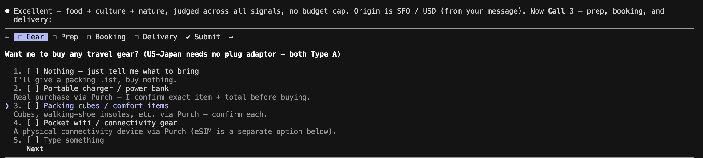
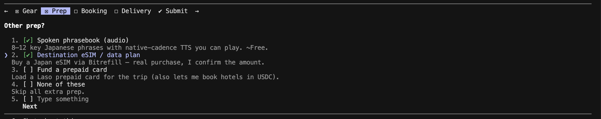
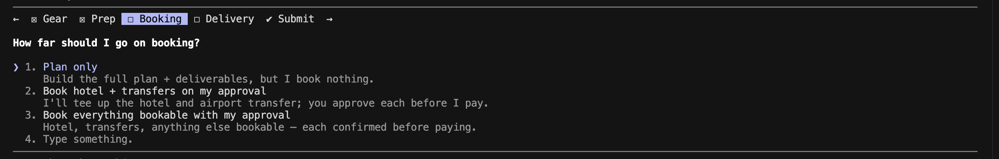
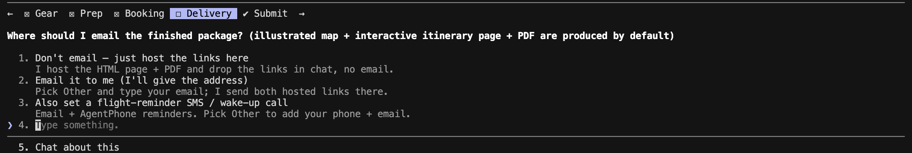
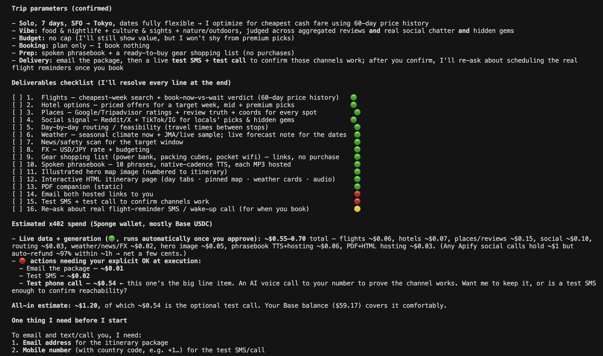

# trip-planner — what it is, in plain words

**A travel agent that actually does the work.** You tell it where you want to go; it interviews you like a good
concierge, plans the whole trip using *live, real* information, and — if you want — books it, buys what you need,
and hands you a beautiful itinerary you can open on your phone.

The difference from a normal AI trip planner: a free assistant can only *talk* about your trip using generic,
often-stale information. This one **spends a few cents to pull real, up-to-the-minute data and to take real
actions on your behalf** — so the plan is genuinely better, and it's actually done, not just described.

---

## How it works (the conversation)

It starts by **asking, not assuming** — a short back-and-forth to find exactly what *you* want:

1. **The basics** — when you're going, how long, who's coming, and whether you're chasing the cheapest cash fare
   or want to burn miles.
2. **Your taste** — what you're into (nightlife, food, culture, nature, relaxing) and your budget style (high-end
   hotels + Michelin, or cheapest beds + the most-talked-about spots on TikTok/Reddit), and how you want it to
   judge "good" (star ratings vs. what locals actually say vs. hidden gems).
3. **What to handle for you** — it looks at your trip and offers to take care of the surrounding stuff:
   - buy any **gear** it spots you'll need (e.g. the right **plug adaptor**, a power bank),
   - set you up with an **eSIM / data plan** so your phone works the moment you land,
   - make a **spoken phrasebook** (audio of key local phrases you can play),
   - schedule a **wake-up call** before your flight.
4. **Plan, or make it real?** — finally it asks whether to *just plan*, or to go ahead and **book the hotel/
   transfers and buy the products** you picked (always confirming each purchase first).

---

## Why it's better than a free planner

Because it can pay for things a free assistant simply can't reach:

- **"Book now or wait?"** — it pulls **60 days of real flight price history**, so it can tell you this week is a
  price dip, or that fares won't drop before your dates. A free planner only sees today's number.
- **Where locals *actually* go** — it reads real Reddit threads and scrapes trending TikTok/Instagram for a place,
  not a recycled top-10 list.
- **The honest truth on a hotel or restaurant** — it aggregates real reviews and ratings, not a vibe.
- **Weather, transit, and safety for your exact dates** — real forecasts, real routes between your stops, and a
  check for strikes/closures happening while you're there.
- **It buys and books** — the eSIM, the adaptor, the hotel, the airport transfer — paid in stablecoin, with your
  approval, no credit-card juggling.
- **It hands you something real** — not a wall of chat text, but a polished, shareable itinerary.

Think of the free version as a knowledgeable friend giving advice, and this as a **travel agent who books it,
buys the bits, and couriers over the folder**.

---

## What you walk away with

- **An interactive itinerary page** (a link you open on your phone): a day-by-day plan with tabs, an
  illustrated map of your trip, a real pinned map with **"Open in Maps" directions** for every spot,
  weather at a glance, and a **tap-to-hear phrasebook**.
- **A PDF version** for offline / printing (works with no signal, e.g. on the plane).
- **It's emailed to you**, and the eSIM, bookings, and any gear are sorted — with a tidy summary of what it did.

---

## What it costs

The *planning* is astonishingly cheap — typically **well under a dollar** of live-data and generation calls for a
full trip (real prices, reviews, forecasts, the map, the phrasebook, the page + PDF). You only spend more when
**you approve a real purchase** (a hotel, an eSIM, a travel adaptor) — and that's just the price of the thing
itself. It shows you an itemized receipt at the end.

## It never spends without asking

- Tiny data look-ups and generating your itinerary happen automatically once you approve the plan.
- **Anything that costs real money or is irreversible** — booking a hotel, buying an eSIM/gear, sending an email,
  placing a call — **always stops and asks you first**, showing the exact amount, before it happens.

---

## See it in action

<!-- Captions are a starting guess — reorder/relabel to match what each screenshot actually shows. -->

---

## Try it
Open your assistant and say, in your own words:

> *"Plan a trip to Tokyo for me — I'm based in San Francisco."*

It takes it from there.

Under the hood it pays per use in stablecoin (USDC over the x402 protocol) from a wallet you control — but
you never have to think about that; it just works, and it only pays for what's worth paying for.
